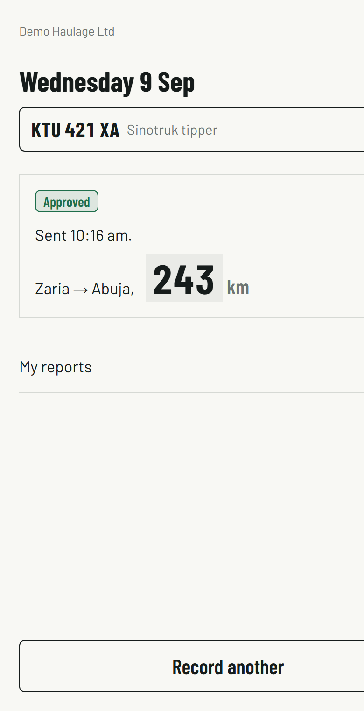
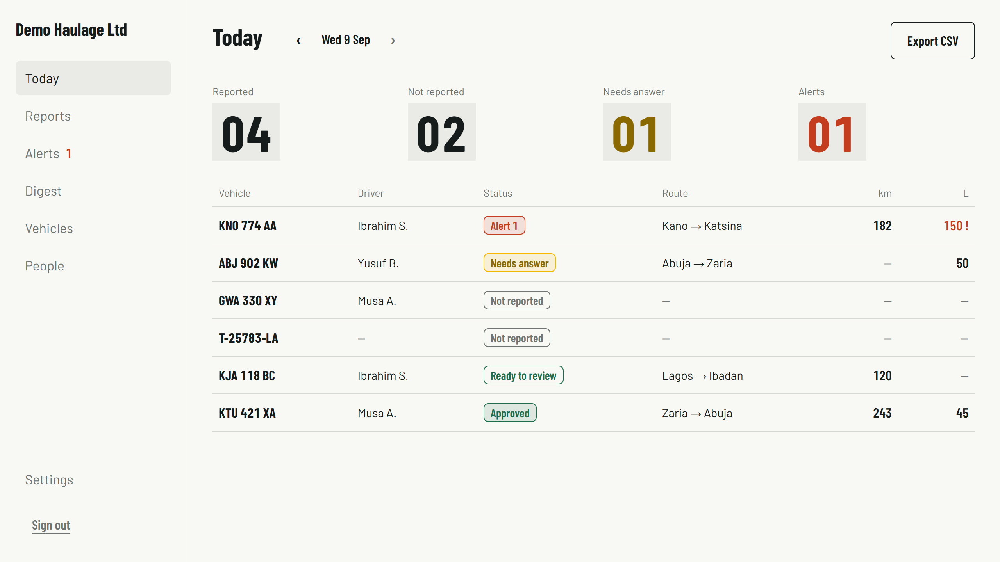
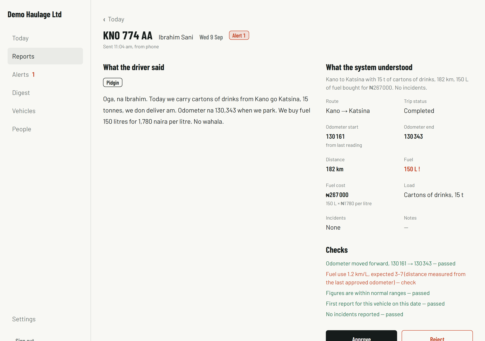

# Field Ops Reporter

Field workers (drivers, site staff) send a voice note from a low-bandwidth PWA. An AI agent
transcribes it, extracts a structured daily report, checks it against the vehicle's history, asks a
follow-up question if something is missing, and posts it to a supervisor dashboard with anomalies
flagged. Multi-tenant SaaS for small logistics, haulage and construction firms in Nigeria, where daily
reports today are WhatsApp voice notes, phone calls and paper logbooks, and where nobody
cross-checks the odometer against the fuel.

| The driver's phone | The supervisor's board | A report that failed a check |
|---|---|---|
|  |  |  |

## How it works

```
┌──────────────┐   audio + meta    ┌──────────────────────────────────┐
│ Field PWA    │ ────────────────▶ │ Next.js 16 (App Router)          │
│ record, queue│ ◀──── status ──── │  server actions  upload, answers │
│ in IndexedDB │                   │  /api/process    the pipeline    │
└──────────────┘                   │  /api/cron/*     sweep, digest   │
                                   └──────┬───────────────┬───────────┘
┌──────────────┐                          │               │
│ Supervisor   │ ◀── server components ───┘               ▼
│ dashboard    │                            ┌──────────────────────────┐
└──────────────┘                            │ Supabase                 │
                                            │  Postgres + RLS          │
                                            │  Auth (email code)       │
                                            │  Storage: report-audio   │
                                            └──────────────────────────┘

one report:  audio ─▶ Groq Whisper (STT) ─▶ Gemini structured extraction ─▶ deterministic validation
                                                                              ├─▶ alerts
                                                                              ├─▶ one clarifying question, back to the phone
                                                                              └─▶ ready for review ─▶ digest (Gemini writes
                                                                                  the prose from the rows, never from audio)
```

A report walks `queued → transcribing → extracting → validating → ready | needs_clarification`.
Every transition is a compare-and-set on the row, so two workers never process the same report;
each step's output is saved before the next, so a crash costs a retry and never a transcript. If a
provider is slow or rate-limited the run gives up inside its time budget, re-queues the report and
fires itself again, three strikes at most.

### The principle: the model handles language, code handles numbers

The model's only job is to turn what the driver *said* into fields (Pidgin included). Every number
that means something is then computed or compared in plain TypeScript with named thresholds:
odometer monotonic against the last approved reading, km per litre against the fleet's baseline,
sane ranges, duplicates. No prompt contains a threshold, and no alert is ever raised by a model.

Two examples from a real report: the driver said "450 litres at 1,760". The model records
`fuel_liters: 450` and `fuel_price_per_l_ngn: 1760`; the total, **₦792,000 = 450 × ₦1,760**, is
multiplied in code and shown as such. And when speech-to-text turned the odometer into "my meter
read 1 to 65.78", the model is told not to rebuild a plausible number: it leaves the field empty
with low confidence, and code turns that into one question for the driver instead of a guess in the
books.

## Stack

- **Next.js 16** (App Router, server actions, route handlers), **React 19**, **TypeScript**, **Tailwind v4**
- **Supabase**: Postgres with row-level security for multi-tenancy, email-code auth, private storage for audio
- **Groq** Whisper large v3 for speech-to-text (English and Nigerian Pidgin; the app re-labels Pidgin from the words)
- **Gemini** (`gemini-3.5-flash`) with structured JSON output for extraction, and for the daily digest's prose
- **Vercel** hosting and cron; a PWA with a service worker and an IndexedDB queue on the phone
- **Vitest** for the rules, the state machine, the CSV and the helpers

## Run it locally

Third-party accounts you need first (free tiers are enough): a [Supabase](https://supabase.com)
project, a [Google AI Studio](https://aistudio.google.com) key, a [Groq](https://console.groq.com) key.
From a fresh clone, the steps below take about ten minutes.

1. Install and copy the environment template:

   ```bash
   git clone https://github.com/Sirhid24k/field-ops-reporter.git
   cd field-ops-reporter
   npm install
   cp .env.example .env.local
   ```

2. Fill in `.env.local`. Every key is documented in `.env.example`; where each comes from:

   | Key | Where |
   |---|---|
   | `NEXT_PUBLIC_SUPABASE_URL`, `NEXT_PUBLIC_SUPABASE_ANON_KEY`, `SUPABASE_SERVICE_ROLE_KEY` | Supabase → Project settings → API |
   | `SUPABASE_DB_URL` | Supabase → Project settings → Database → Connection string → **Session pooler** (port 5432), password percent-encoded |
   | `GEMINI_API_KEY` | Google AI Studio → Get API key. Leave `EXTRACTION_MODEL` / `DIGEST_MODEL` at `gemini-3.5-flash` |
   | `STT_API_KEY` | console.groq.com → API keys. `STT_PROVIDER=groq` |
   | `CRON_SECRET` | Any long random string (`openssl rand -hex 32`); it guards the internal routes |
   | `SEED_EMAIL_BASE` | An inbox you can read, e.g. `you@gmail.com`; the demo accounts become `you+musa@gmail.com` … |
   | `NEXT_PUBLIC_APP_URL` | Leave as `http://localhost:3000` |

3. Create the schema (five migrations: schema, row-level security, storage, pipeline bookkeeping, seed tag):

   ```bash
   npm run db:push
   ```

4. Start the app and sign in as the first admin. No email needs to be delivered locally: the helper
   prints the one-time code and a same-browser link for any address, creating the user if needed.

   ```bash
   npm run dev
   ```

   ```bash
   npm run dev:magic-link -- you@gmail.com /onboarding
   ```

   Open the printed link (or go to http://localhost:3000/signin, enter the address and type the
   printed code). Onboarding asks for your name and your business: name it **Demo Haulage Ltd**,
   keep Africa/Lagos and the 8:00 pm cutoff, and skip the vehicle and invite steps.

5. Fill the organisation with demo data:

   ```bash
   npm run seed
   ```

   Expected result (about a minute): four accounts (three drivers, one supervisor, all reachable at
   your inbox), five vehicles, 55 approved reports over the last twelve days, today's board with one
   vehicle in each state (approved, ready to review, needs an answer, not reported, and a fuel outlier
   with an open alert), an acknowledged breakdown from two days ago, three past digests, and the
   fleet's fuel baseline. The script prints the addresses and a summary table, and refuses to touch
   any row it did not create; run it again any time to reset the demo.

6. Look at it. The dashboard is at http://localhost:3000/dashboard as the admin you just created.
   For a driver's phone view, sign in as one of the seeded drivers (a private window is easiest):

   ```bash
   npm run dev:magic-link -- you+musa@gmail.com /app
   ```

   Add the app to your phone's home screen from the same URL on your local network to get the
   installable PWA with the offline queue.

### Signing in

Sign-in is an email one-time code (six digits; the project setting "Email OTP length" must match
`NEXT_PUBLIC_OTP_LENGTH`). The email also carries a same-device link as a fallback. Locally, and for
the seeded accounts, `npm run dev:magic-link -- <email> [next-path]` prints both, so no email has
to arrive. For real delivery, Supabase's built-in sender is enough for a demo (a handful of real
addresses, about thirty emails an hour; some projects limit it to the Supabase team's addresses),
and for anything more, point Authentication → SMTP settings at Brevo or any other SMTP provider.
Before sending real email, paste the two templates in `supabase/email-templates/` into
Authentication → Email Templates (Magic Link and Confirm signup), and add your origin plus
`http://localhost:3000/**` under Authentication → URL configuration → Redirect URLs so the fallback
link comes back to the app.

## Testing

```bash
npm test
```

Runs the Vitest suites: the validation rules and every threshold, the cost derivation and
promotion, the clarification decision, the retry and settlement logic of the state machine, the
digest date arithmetic, the board rules, the CSV writer and the request-origin helper.

```bash
npm run pipeline:test -- path/to/clip.webm
```

Uploads a real clip (webm, m4a or ogg) as a report for the demo driver, runs the whole pipeline
inline and prints the transcript and language, the extracted fields, every check, any question and
any alert. Also `--text "…"` for a typed report, `--report <id>` to re-run one, `--report <id>
--answer "…"` to answer its question, `--cleanup` to remove it afterwards. `npm run digest:test --
[YYYY-MM-DD]` generates a digest and cross-checks its totals against the rows, and `npm run
rls:proof -- <admin-email> <driver-email>` proves the row-level security with real user tokens.

Other scripts: `npm run typecheck`, `npm run lint`, `npm run build`, `npm run db:types` (regenerates
the database types; needs Docker), `npm run icons` (the PWA icons and favicon), `npm run seed --
--wipe` (removes everything the seed created).

## Deployment

The app runs on Vercel with the same environment variables as `.env.local`, minus the `SEED_*` ones
(set `NEXT_PUBLIC_APP_URL` to the deployed origin; sign-in redirects, invite links and the
pipeline's self-call derive their origin from the request, so previews work without changes).
Leave `DEV_TOOLS` unset in production: the developer pages under `/dev` then answer 404.

- **Crons** (`vercel.json`): the stuck-report sweep at 03:00 UTC and the digest at 19:30 UTC, once a
  day, which is the most the Vercel Hobby plan allows. Recovery does not depend on them: every
  `/api/process` call sweeps first, and the digest can always be generated on demand.
- **Time budget**: `/api/process` and the cron routes declare `maxDuration = 60`; the pipeline gets
  40 s of it, gives up early when a provider is slow, re-queues the report and triggers itself again.
- Hobby keeps runtime logs for one hour. The pipeline writes one JSON line per step
  (`{"src":"pipeline","reportId":…,"step":…,"ms":…}`); grep a report id to see where its time went.

## Roadmap

Deliberately out of v1, in the order we would take them on:

1. **WhatsApp** as a second input channel: the same voice note, sent to a business number instead of the app.
2. **Hausa** transcription (and Yoruba, Igbo), once quality on real recordings is checked.
3. **Photos** of the odometer and the waybill attached to a report.
4. **Per-vehicle charts**: fuel efficiency and distance over 30 days.
5. **Phone-number or PIN sign-in** for drivers without email.
6. **Telematics import** (GPS, load sensors) as another source of checks, not a replacement for the report.
7. Native app shells, a multi-language UI, payroll and route optimisation, later.

## License

MIT. See `LICENSE`.
